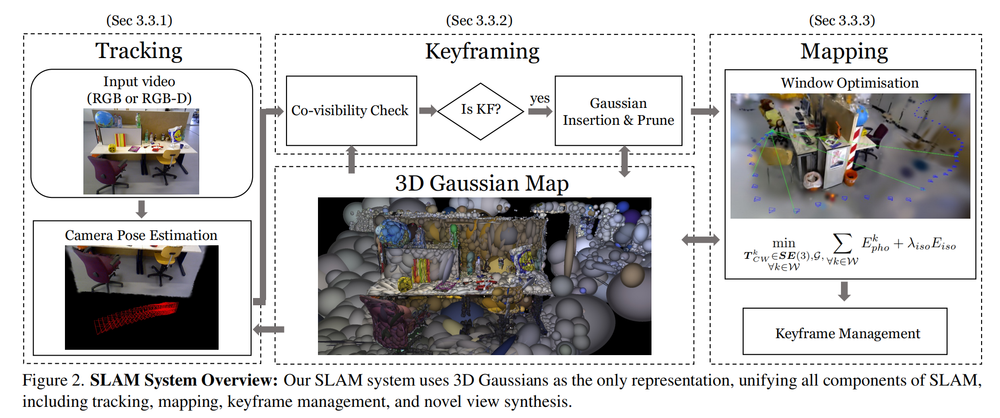
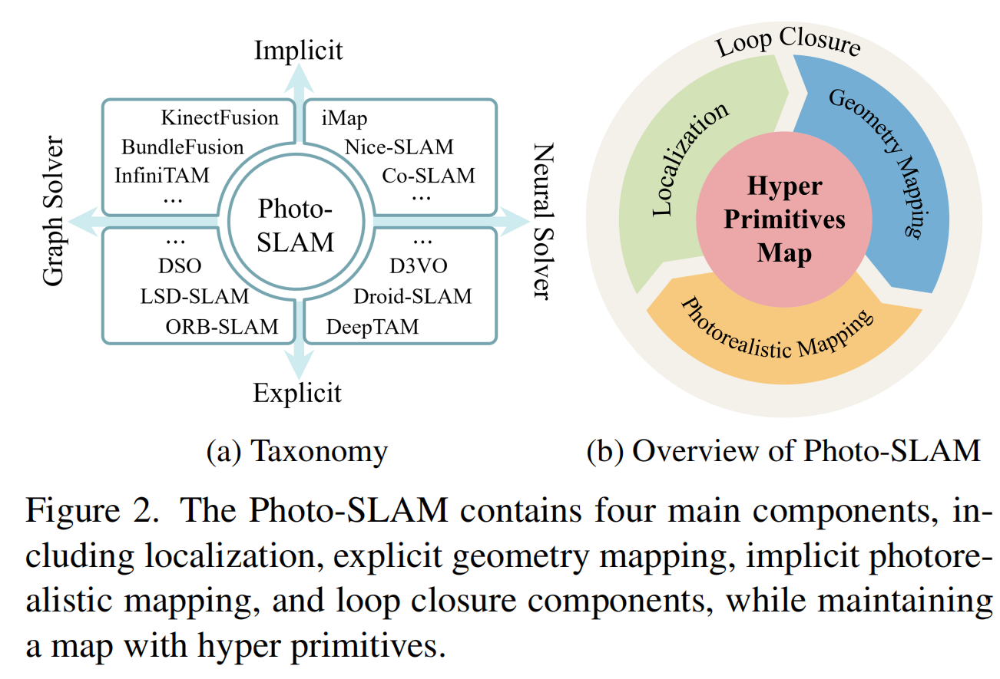
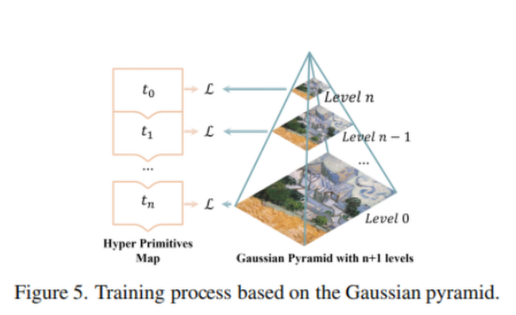

如下三篇均为 2024 CVPR 上发表的关于 `Gaussian SLAM` 的论文，本质流程都基本一致，只有实现细节的细微不同。事实上，考虑到从今天来看，高斯SLAM本身并非一个足够优秀的方法，并且缺陷严重，所以不对指标和实现部分进行学习和思考，只对这些论文的方法及进行简明扼要的介绍。
## Gaussian Splatting SLAM

对于 `Gaussian SLAM` ， 其本质是将3D高斯泼溅作为SLAM流程中唯一的场景表示。
在传统的SLAM方法中，一般依靠图像构建稀疏的特征点或者体素网格，而 `高斯SLAM` 使用各向异性3D高斯椭球（其参数包括位置$\mu_w$、协方差$\Sigma_W$、颜色$c_i$和透明度$\alpha_i$）作为基本单元。每个高斯通过可微渲染合成像素颜色，实现几何与外观的统一建模。

其本身为了提升优化速度，直接简化了球谐函数，简单来说，将球谐函数简化为了0维度，即一个球谐函数只能表达一种颜色。其本质是为了提升优化速度，但是这一设计直接导致 `Gaussian SLAM` 方法在面临大场景变化（如室外或前进）时会进行大量的高斯球增加修改，直接导致崩溃。并且建图展示水平堪忧。

### 高斯泼溅

由于为了优化加速，将高斯球的球谐函数设置为0阶，即只有一种颜色。通过将 $N$ 个高斯分布进行投影混合，即可合成像素颜色$C_p$：
$$
C_p = \sum_{i \in N} c_i \alpha_i \prod_{j=1}^{i-1} (1 - \alpha_j) \tag{1}
$$

其中 $c_i$ 和 $\alpha_i$ 分别是颜色和透明度。**3DGS** 执行光栅化过程，其遍历的是高斯分布而非沿相机射线进行推进，因此在渲染过程中会忽略空旷区域。在光栅化过程中，权重 $\alpha$ 的贡献通过一个高斯函数进行衰减，该函数基于将三维高斯分布投影到二维平面上所形成的二维高斯分布来确定。

世界坐标系中的三维高斯分布 $\mathcal{N}(\mu_W, \Sigma_W)$ 与图像平面上的二维高斯分布 $\mathcal{N}(\mu_I, \Sigma_I)$ 通过一个投影变换相关联：
$$\mu_I = \pi(T_{CW} \cdot \mu_W), \quad \Sigma_I = J W \Sigma_W W^T J^T \tag{2}$$
其中 $\pi$ 为投影操作，$T_{CW} \in \mathrm{SE}(3)$ 为视角的相机位姿。$J$ 是投影变换线性近似的雅可比矩阵，$W$ 为 $T_{CW}$ 的旋转部分。该形式使得三维高斯分布具有可微性，且混合操作能够为高斯分布提供梯度传播途径。通过一阶梯度下降，高斯分布逐步优化其视觉与几何参数，以高保真地表示捕获的场景。

### 相机位姿优化

对于3DGS，虽然其本相对高效，但是其中的传统自动微分方法过慢，所以在本文中，作者提出直接手动推导出所有关键量导数（雅可比矩阵），尤其是相机姿态变化时对图像的影响，进而大幅提升速度和精度。
相机位姿在 3D 空间中有 6 个自由度（旋转+平移），但在矩阵形式下（4×4 矩阵）它是冗余的。为了计算最精简，该方法中引入了李群 SE(3) 和李代数 se(3)，来推导出最小化的雅可比矩阵，确保雅可比矩阵的维度与自由度一致，从而消除任何冗余计算。公式 (2) 中的项关于相机位姿 $T_{CW}$ 可微，使用链式法则可得：
$$
\frac{\partial \mu_I}{\partial T_{CW}} = \frac{\partial \mu_I}{\partial \mu_C} \frac{\partial \mu_C}{\partial T_{CW}}, \quad (3)
$$
$$
\frac{\partial \Sigma_I}{\partial T_{CW}} = \frac{\partial \Sigma_I}{\partial J} \frac{\partial J}{\partial \mu_C} \frac{\partial \mu_C}{\partial T_{CW}} + \frac{\partial \Sigma_I}{\partial W} \frac{\partial W}{\partial T_{CW}}, \quad (4)
$$
其中 $T_{CW}$ 表示高斯在相机坐标系中的 3D 位置。我们通过对流形求导，获得最小化参数化形式。借鉴文献 [32] 的记号，设 $T \in \mathrm{SE}(3)$，$\tau \in \mathfrak{se}(3)$。我们定义流形上的偏导数为：
$$
\frac{Df(T)}{DT} \triangleq \lim_{\tau \to 0} \frac{\mathrm{Log}\left( f(\mathrm{Exp}(\tau) \circ T) \circ f(T)^{-1} \right)}{\tau}, \quad (5)
$$
其中 $\circ$ 为群复合运算，$\mathrm{Exp}$ 和 $\mathrm{Log}$ 分别为李代数与李群之间的指数映射与对数映射。基于此，我们推导出：
$$
\frac{\partial \mu_C}{\partial T_{CW}} = 
\begin{bmatrix}
I & -\mu_C^\times
\end{bmatrix},
\quad
\frac{\partial W}{\partial T_{CW}} = 
\begin{bmatrix}
0 & -W_{:,1}^\times \\
0 & -W_{:,2}^\times \\
0 & -W_{:,3}^\times
\end{bmatrix}, \quad (6)
$$
其中 $\times$ 表示三维向量的反对称矩阵，$W_{:,i}$ 表示矩阵 $W$ 的第 $i$ 列。

### SLAM

整个SLAM的结构如下图

#### 跟踪

在 **Tracking** 部分中仅执行对于相机位姿的更新，不对地图表示进行修改。正如一般传统单目SLAM中，追求最小化光度误差；Gaussian SLAM 中最小化如下光度误差：
$$
E_{\text{pho}} = \| I(G, T_{CW}) - \bar{I} \|_1, \quad (7)
$$

其中 $I(G, T_{CW})$ 表示从相机位姿 $T_{CW}$ 渲染得到的高斯分布 $G$ 的图像，$\bar{I}$ 为观测到的真实图像。

在该方法中进一步对仿射亮度参数进行优化，以适应曝光变化，并对非边缘区域或低透明度像素施加惩罚（对于低透明度像素，其在3DGS中往往是噪声或半透明背景，不具有参考价值；非边缘区域即平坦无纹理区域一般在视觉SLAM中是无效信息，相当于噪声，故而去除）。当深度可观测时，集合误差项被定义如下：
$$
E_{\text{geo}} = \| D(G, T_{CW}) - \bar{D} \|_1, \quad (8)
$$

其中 $D(G, T_{CW})$ 为深度光栅化结果，$\bar{D}$ 为观测到的深度图。不同于简单地使用深度测量来初始化高斯分布，该方法同时最小化光度误差与几何误差：$\mathcal{L} = \lambda_{\text{pho}} E_{\text{pho}} + (1 - \lambda_{\text{pho}}) E_{\text{geo}}$，其中 $\lambda_{\text{pho}}$ 为超参数，用于调节两者权重。

与公式 (1) 类似，每个像素的深度通过 $\alpha$ 混合方式进行光栅化：
$$
D_p = \sum_{i \in \mathcal{N}} z_i \alpha_i \prod_{j=1}^{i-1} (1 - \alpha_j), \quad (9)
$$

其中 $z_i$ 表示第 $i$ 个高斯沿相机视线方向到其均值 $\mu_W$ 的距离。该方法中采用与公式 (3)、(4) 类似的方式，推导出相机位姿优化的解析雅可比矩阵。

#### 关键帧

对于通过高斯表征所有图像的操作本身就开销巨大，联合优化高斯分布和相机位姿的操作显然不可行，所以该方法中通过关键帧的方式构成一个小窗口 $\mathcal{W}_k$ ，其选取基于帧间共视性（covisibility）。理想的关键帧管理策略应选择非冗余、观测同一区域且具有较大基线跨度的关键帧，以提供更强的多视角约束。

##### 关键帧选择与管理

本质要求帧与帧之间既不相交太多，又不相交太少。在该方法中，通过计算当前帧 $i$ 与上一个关键帧 $j$ 之间观测到的高斯分布的交并比（IoU） 来衡量共视性。

- 若共视性低于设定阈值，或
- 相对平移 $\mathbf{t}_{ij}$ 相对于中值深度过大，

则将帧 $i$ 注册为关键帧。

对于优化窗口 $\mathcal{W}_k$ 中仅保留少量关键帧。主要区别在于：若某关键帧与最新关键帧之间的重叠系数低于阈值，则将其从当前窗口中移除。

##### 高斯共视性估计

准确估计共视性可显著简化关键帧的选择与管理。3DGS 保留了可见性排序，因为 3D 高斯分布在相机光线上已按深度顺序排列。这一特性对于共视性估计至关重要，因为它天然地处理了遮挡问题。
一个高斯在某视角下被标记为可见，当且仅当：

- 它参与了该视角的光栅化；
- 并且光线上累积的 $\alpha$ 值尚未达到 0.5。

这一机制使估计的共视性能够自动处理遮挡情况，无需额外启发式策略。

##### 高斯插入与剪枝

在每个关键帧处，向场景中插入新高斯，以捕捉新可见的场景元素并细化细节。当有深度测量可用时，高斯均值 $\mu_W$ 通过逆向投影深度初始化。

在单目情况下，我们渲染当前帧的深度图：

- 对于具有深度估计的像素，$\mu_W$ 在该深度附近初始化，并设置较低的方差；
- 对于无深度估计的像素，在渲染图像的中值深度处初始化 $\mu_W$，并设置较高的方差。

在单目场景下，新插入的许多高斯位置是不准确的。虽然大多数会在后续优化中因违反多视角一致性而快速消失，我们仍通过检查这些高斯在当前窗口 $\mathcal{W}_k$ 内的可见性，进一步剪枝冗余高斯。

具体规则为：若某个高斯在最近 3 个关键帧内插入，且在至少 3 个其他帧中均未被观测到，则将其剪除。因为这类高斯存在几何不稳定性，属于无效或错误初始化的点。

#### 建图

建图的目的是维持一个连贯的 3D 结构，并优化新插入的高斯分布。在建图过程中，当前窗口 $\mathcal{W}_k$ 中的关键帧被用于重建当前可见的场景区域。此外，为防止遗忘全局地图，每轮迭代中会随机选取两个历史关键 $\mathbf{W}_r$ 参与优化。

3DGS 的光栅化过程对沿观察方向的高斯分布不施加任何约束，即使存在深度观测也是如此。当有足够且精心选择的视角时（如新视角合成任务），这通常不是问题；但在连续 SLAM 场景中，这会导致大量伪影，从而增加跟踪难度。

为此，在该方法中引入各向同性正则化项：

$$
E_{\text{iso}} = \sum_{i=1}^{|G|} \left\| \mathbf{s}_i - \tilde{\mathbf{s}} \cdot \mathbf{1} \right\|_1, \quad (10)
$$

其中 $\mathbf{s}_i$ 为第 $i$ 个高斯的尺度参数（即椭球体在各方向上的拉伸程度），$\tilde{\mathbf{s}}$ 为所有尺度参数的均值。该项通过惩罚 $\mathbf{s}_i$ 与其均值的差异，抑制高斯在视线方向上的过度拉伸。
如图 3 所示，该正则化项促使高斯分布趋向球形，有效避免了因高斯沿观察方向严重拉长而引发的视觉伪影。
令当前窗口关键帧与随机选取的历史关键帧的并集为 $\mathcal{W} = \mathcal{W}_k \cup \mathbf{W}_r$。建图阶段求解如下优化问题：
$$
\min_{\substack{T_{CW}^{(k)} \in \mathrm{SE}(3) \\ G,\ \forall k \in \mathcal{W}}} \sum_{k \in \mathcal{W}} E_{\text{pho},k} + \lambda_{\text{iso}} E_{\text{iso}}, \quad (11)
$$

若存在深度观测（如在跟踪阶段所述），则在优化中额外加入几何残差项（公式 (8)）： $E_{\text{geo}} = \left\| D(G, T_{CW}) - \bar{D} \right\|_1$ 从而实现光度与几何信息的联合优化，显著提升建图的精度与鲁棒性。

### 总结

**Gaussian SLAM** 本质就是将传统SLAM中的图像表征方法从简单的点云或网格替换为使用**零阶球谐函数**的3D高斯。

其本身定位还是通过**光度一致性**和**深度一致性**来进行最优化求解位姿。其本身为了保证实时性，本质上进行了许多牺牲，导致实际三维建模常见粗糙，并且显而易见的定位上无法在移动跨度过大或持续场景变化的情况下保持精准。

虽然 **3DGS** 本身是一个很好的场景表示方法，但是其本质是为了解决多视角合成渲染问题，尽管其本身高斯球等信息显式的标注了结构信息，并且 **3DGS** 中能直接获取RGB渲染和深度图，故而相比于过去的SLAM方法，该表征方法更优。但是从2026年的角度来看，显式表示场景仍不是一个足够高校的方式，其本身的噪声影响和计算量之间的平衡是最终的问题。

在当今的三维视觉中，这些操作已经逐步变成完全依靠隐式建模+神经网络的形式构建完整的场景并实现定位。但是实现真正的实时性、鲁棒性，实现对于不同设备特性、多元数据的融合才是最需要解决的事情。

## Photo-SLAM

该方法依旧是高斯SLAM，甚至于其本身是 `Gaussian Splatting SLAM` 的同期方法。该方法同时利用显式几何特征进行定位，并学习隐式光度特征以表征环境的纹理信息。
除了基于几何特征主动稠密化超原始体外，进一步引入了一种基于高斯金字塔的训练方法，以逐步学习多层级特征，显著提升逼真场景重建的性能。该方法在可以接收单目、双目和RGB-D这些多元数据。
该方法能高度还原三维场景，并且在便携设备上使用。

该方法包括四个核心模块：定位（localization）、几何建图（geometry mapping）、逼真图像建图（photorealistic mapping）和回环检测（loop closure）。
整个结构如下图所示：

### 超原始体地图（Hyper Primitives Map）

在本系统中，超原始体被定义为一组点云 $\mathcal{P} \in \mathbb{R}^3$，每个点关联以下多维属性：

- ORB 特征 $\mathbf{O} \in \mathbb{R}^{256}$：从图像帧中提取的局部视觉描述子，用于建立 2D 到 2D 及 2D 到 3D 的对应关系；
- 旋转 $\mathbf{r} \in \mathrm{SO}(3)$：表示该点所在坐标系相对于全局坐标系的朝向；
- 缩放 $s \in \mathbb{R}^3$：用于补偿尺度变化，提升建图鲁棒性；
- 密度 $\sigma \in \mathbb{R}^1$：表示该点的空间密度，影响其在重建中的重要性；
- 球谐函数系数 $\mathrm{SH} \in \mathbb{R}^{16}$：用于隐式建模点周围光照和纹理信息，支持高质量渲染。

ORB 特征从图像帧中提取，主要承担建立帧间 2D 对应（2D-to-2D）和与三维点之间的 2D-to-3D 匹配任务。当系统基于相邻帧间充足的 2D-to-2D 对应关系成功估计出变换矩阵后，便通过三角化（triangulation）初始化超原始体地图，随后开启位姿跟踪流程。
在跟踪阶段：

- **定位模块** 处理输入图像，利用 2D 到 3D 的对应关系实时计算当前相机的位姿；
- **几何建图模块** 逐步生成并初始化稀疏的超原始体；
- **逼真图像建图模块** 则对超原始体进行渐进式优化与稠密化，通过融合多视角观测，不断提升其空间分布与外观质量，最终构建出兼具几何精度与视觉真实感的场景表示。

这一多模态、分层的超原始体地图结构，使得 Photo-SLAM 能在无需密集深度信息的前提下，实现高效、精准且视觉逼真的在线建图。

### 定位与几何建图

定位（Localization）与几何建图（Geometry Mapping）模块不仅能够高效地估计输入图像的 6-DoF 相机位姿，还能够生成稀疏的 3D 点云。该优化问题被建模为一个因子图（factor graph），并通过 **Levenberg–Marquardt**（LM）算法求解。

在**定位线程**中，采用仅运动的捆绑优化策略，优化相机的旋转 $\mathbf{R} \in \mathrm{SO}(3)$ 和平移 $\mathbf{t} \in \mathbb{R}^3$，以最小化匹配的 2D 几何特征点 $\mathbf{p}_i$ 与对应 3D 点 $\mathbf{P}_i$ 之间的重投影误差。

设 $\mathcal{X}$ 为匹配点对的集合，索引 $i \in \mathcal{X}$。我们通过 LM 算法优化的目标为：

$$
\{\mathbf{R}, \mathbf{t}\} = \arg\min_{\mathbf{R}, \mathbf{t}} \sum_{i \in \mathcal{X}} \rho \left( \left\| \mathbf{p}_i - \pi(\mathbf{R} \mathbf{P}_i + \mathbf{t}) \right\|^2_{\Sigma_g} \right), \quad (1)
$$

其中：

- $\Sigma_g \in \mathbb{R}^{2 \times 2}$ 是特征点的与尺度相关的协方差矩阵，用于加权重投影误差；
- $\pi(\cdot)$ 表示从 3D 点到 2D 像素的投影函数（通常为针孔相机模型）；
- $\rho(\cdot)$ 是鲁棒的 Huber 损失函数，用以抑制异常值（outliers）对优化的干扰。

此优化过程使得相机位姿在局部范围内尽可能地与观测特征点对齐，保障定位精度。

在**几何建图线程**中，对一组共可见点集 $\mathcal{P}_L$ 和关键帧集合 $\mathcal{K}_L$ 执行局部捆绑调整。

- 关键帧（keyframes）是从输入相机序列中选取的具有丰富视觉信息的代表性帧；
- 每个关键帧在因子图中表示为一个节点，边表示关键帧与匹配 3D 点之间的约束关系；
- 优化过程中，通过迭代更新关键帧的位姿和 3D 点的位置，最小化重投影残差。

为提高效率与稳定性，系统固定那些观测了 $\mathcal{P}_L$ 但本身不在 $\mathcal{K}_L$ 中的关键帧的位姿。令： $\mathcal{K} = \mathcal{K}_L \cup \mathcal{K}_F$， 其中  $\mathcal{K}_F$ 为固定位姿的关键帧。
设 $\mathcal{X}_k$ 为关键帧 $k \in \mathcal{K}_L$ 中 2D 特征点与 $\mathcal{P}_L$ 中 3D 点之间的匹配集合。优化目标是减小集合 $\mathcal{K}$ 与 $\mathcal{P}_L$ 之间的几何不一致性，其优化问题定义为：

$$
\{\mathbf{P}_i, \mathbf{R}_l, \mathbf{t}_l | i \in \mathcal{P}_L, l \in \mathbf{K}_l \} = \arg\min_{\mathbf{P}_i, \mathbf{R}_l, \mathbf{t}_l} \sum_{k \in \mathcal{K}} \sum_{j \in \mathcal{X}_k} \rho \left(E(k,j)  \right),  \quad (2)
$$

此处残差块定义如下 

$$E(k,j)=||P_j-\pi(R_kP_j+t_k)||^2_{\Sigma_g}$$

该过程持续提升 $\mathcal{P}_L$ 的空间一致性与精度，为后续的逼真建图模块提供高质量的几何基础。

### 逼真图像建图 （Photorealistic Mapping）

逼真图像建图模块负责对几何建图模块逐步生成的超原始体（hyper primitives）进行优化，以实现高保真、视觉逼真的三维场景重建。这些超原始体通过基于分块（tile-based）的渲染器进行光栅化，并结合关键帧的位姿合成对应的图像。

$$
C(\mathbf{R}, \mathbf{t}) = \sum_{i \in N} \mathbf{c}_i \alpha_i \prod_{j=1}^{i-1} (1 - \alpha_j), \quad (3)
$$

其中：

- $N$ 为参与渲染的超原始体总数；
- $\mathbf{c}_i \in \mathbb{R}^3$ 表示第 $i$ 个超原始体的颜色，由其球谐函数系数 $\mathrm{SH}_i \in \mathbb{R}^{16}$ 经过光照重建转换而来；
- $\alpha_i = \sigma_i \cdot G(\mathbf{R}, \mathbf{t}, \mathbf{P}_i, \mathbf{r}_i, \mathbf{s}_i)$ 为该超原始体的透明度，表示其对最终图像的贡献；
- $G(\cdot)$ 是3D 高斯点 splatting 算法，用于计算高斯核在图像平面上的投影强度；
- $\sigma_i \in \mathbb{R}$ 为该超原始体的密度，决定其可见性；
- $\mathbf{P}_i \in \mathbb{R}^3$、$\mathbf{r}_i \in \mathrm{SO}(3)$、$\mathbf{s}_i \in \mathbb{R}^3$ 分别表示其空间位置、旋转和缩放参数。
- 乘积项 $\prod_{j=1}^{i-1} (1 - \alpha_j)$ 表示深度排序下的透明度累积，实现正确的图像合成顺序（Z-buffer 效果）。

通过优化超原始体的位置 $\mathbf{P}$、旋转 $\mathbf{r}$、缩放 $\mathbf{s}$、密度 $\sigma$ 以及球谐函数系数 $\mathrm{SH}$，最小化合成图像 $I_r$ 与真实图像 $I_{gt}$ 之间的光度损失 $\mathcal{L}$，目标函数为：
$$\mathcal{L} = (1 - \lambda) \left\| I_r - I_{gt} \right\|_1 + \lambda \left(1 - \mathrm{SSIM}(I_r, I_{gt}) \right), \quad (4)$$
其中：

- $\left\| \cdot \right\|_1$ 为 $L_1$ 范数，衡量像素级强度差异，对异常值具有更强鲁棒性；
- $\mathrm{SSIM}(I_r, I_{gt})$ 表示两图像之间的结构相似性，反映图像在结构、纹理与对比度上的匹配程度；
- $\lambda \in [0, 1]$ 为平衡权重，用于协调像素级误差与视觉感知质量之间的权衡。

该损失函数融合了 $L_1$ 误差与 SSIM 信息，在优化过程中能有效提升重建图像的自然感与视觉真实感，是实现“照片级逼真度”建图的核心机制。

#### 基于几何的稠密化

若将逼真图像建图视为对场景的回归模型，更密集的超原始体（即更多参数）通常能更好地建模场景的复杂性，从而实现更高的渲染质量。为了满足实时建图的需求，几何建图组件仅建立稀疏的超原始体。因此，几何建图生成的粗略超原始体需要在逼真图像建图的优化过程中进行稠密化。

除了对损失梯度较大的超原始体进行分裂或克隆之外，该方法中引入了一种额外的基于几何的稠密化策略。

实验表明，帧中2D几何特征点的活跃度低于30%，且具有对应的3D点，尤其在非RGB-D场景中更为明显。我们认为，2D几何特征点在图像中空间分布的区域本质上代表了纹理复杂的区域，需要更多的超原始体。因此，一旦为逼真图像建图创建关键帧，我们便基于未激活的2D特征点主动创建额外的临时超原始体。当使用RGB-D相机时，我们可以直接将带有深度信息的未激活2D特征点投影，以创建临时超原始体。对于单目场景，我们通过其最近邻活跃2D特征点的深度进行解释，来估计未激活2D特征点的深度。在双目场景中，我们依赖立体匹配算法来估计未激活2D特征点的深度。

### 基于高斯金字塔的渐进学习

如上图所示，高斯金字塔是一种多尺度图像表示，包含不同层次的细节信息。它通过反复对原始图像进行高斯平滑和下采样操作构建而成。在训练初始阶段，超原始体由高斯金字塔的最高层（即第 $n$ 层）进行监督。随着训练迭代的进行，我们不仅对超原始体进行稠密化，同时逐步降低金字塔层级，获取新的真实图像作为监督目标，直至到达高斯金字塔的最底层。使用具有 $n+1$ 层的高斯金字塔进行优化的过程可表示为：
$$
\begin{split}
t_0 &: \mathop{\arg\min} \mathcal{L}\left(I^n_{\text{r}}, \text{GP}^n(I_{\text{gt}})\right), \\
t_1 &: \mathop{\arg\min} \mathcal{L}\left(I^{n-1}_{\text{r}}, \text{GP}^{n-1}(I_{\text{gt}})\right), \\
&\dots \\
t_n &: \mathop{\arg\min} \mathcal{L}\left(I^0_{\text{r}}, \text{GP}^0(I_{\text{gt}})\right),
\end{split}
\quad (5)
$$

其中，$\mathcal{L}(I_{\text{r}}, \text{GP}(I_{\text{gt}}))$ 即为式(4)的光度损失函数，$\text{GP}^n(I_{\text{gt}})$ 表示高斯金字塔中第 $n$ 层的真实图像（ground truth）。实验表明，GP学习显著提升了逼真图像建图的性能，尤其是在单目相机场景中表现尤为突出。

### 回环检测（Loop Closure）

检测回环后通过相似变换对局部关键帧和超原始体进行修正。利用修正后的相机位姿，逼真图像建图模块可以进一步消除由里程计漂移导致的鬼影现象，从而显著提升建图质量。

### 总结

比较来看，**Photo-SLAM** 相比于 `Mono-GS` ，其本身更注重建图的高质量，并且在定位上更倾向按照 `ORB-SLAM` 的范式，通过特征点和因子图的方式来反复捆绑优化。

同时 **Photo-SLAM** 为了提升构建场景的高逼真性，其本身的球谐函数并不只是固定在零阶，并且椭球生成和特征点构建高度绑定，通过这个操作极大的拓展的建图的精确性和逼真程度。

